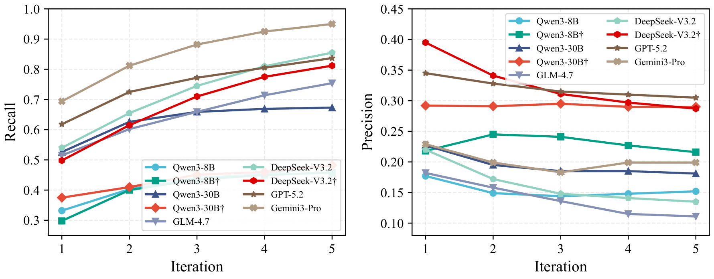
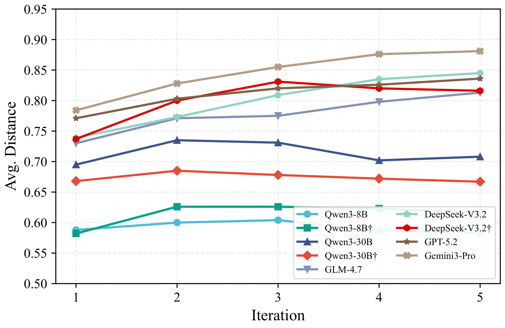
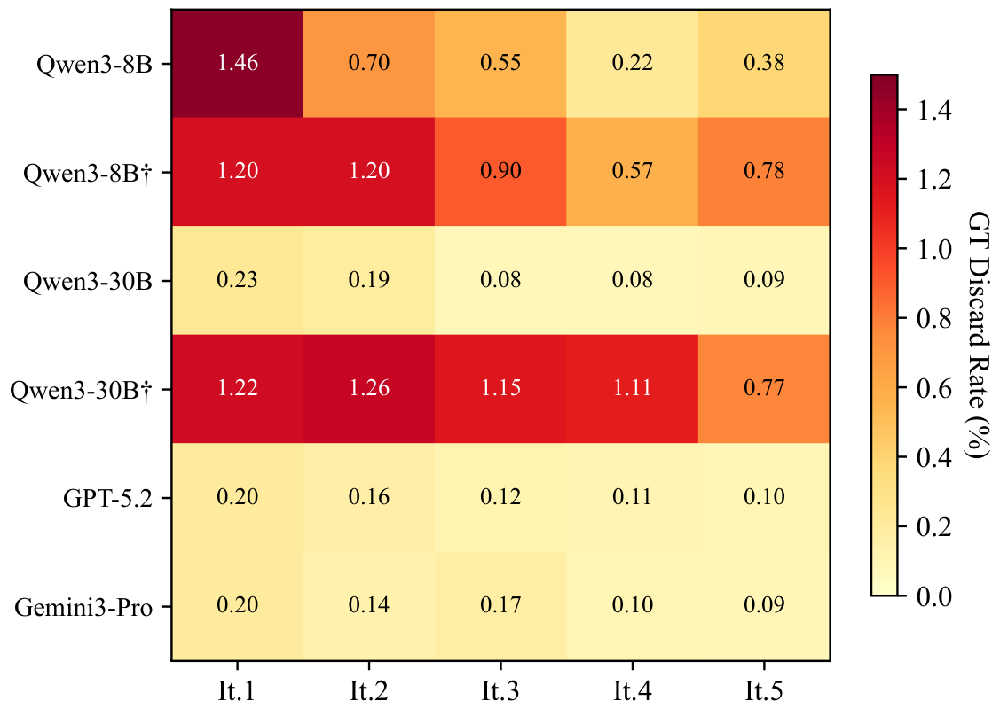
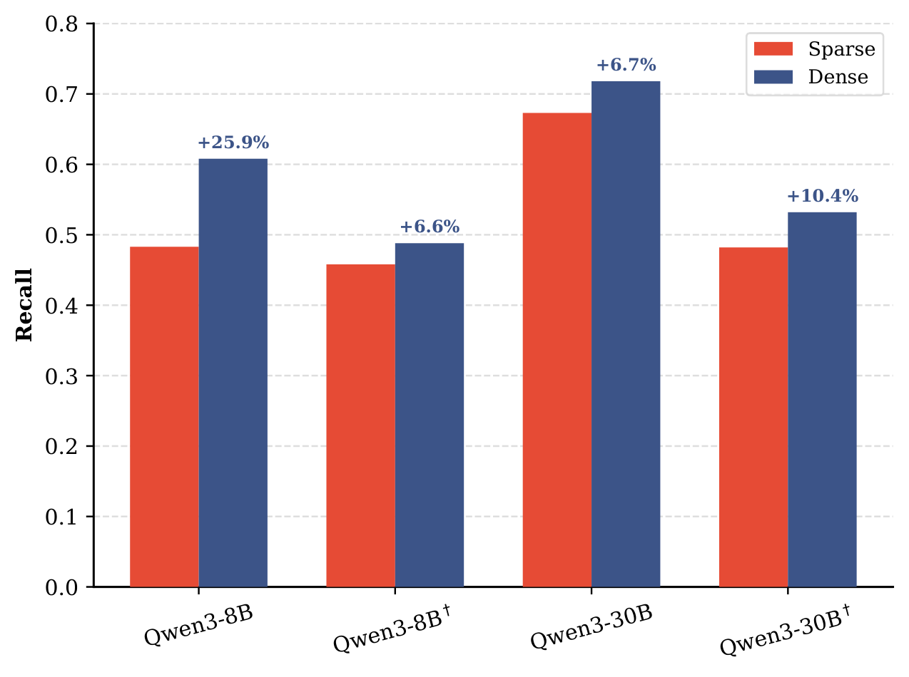
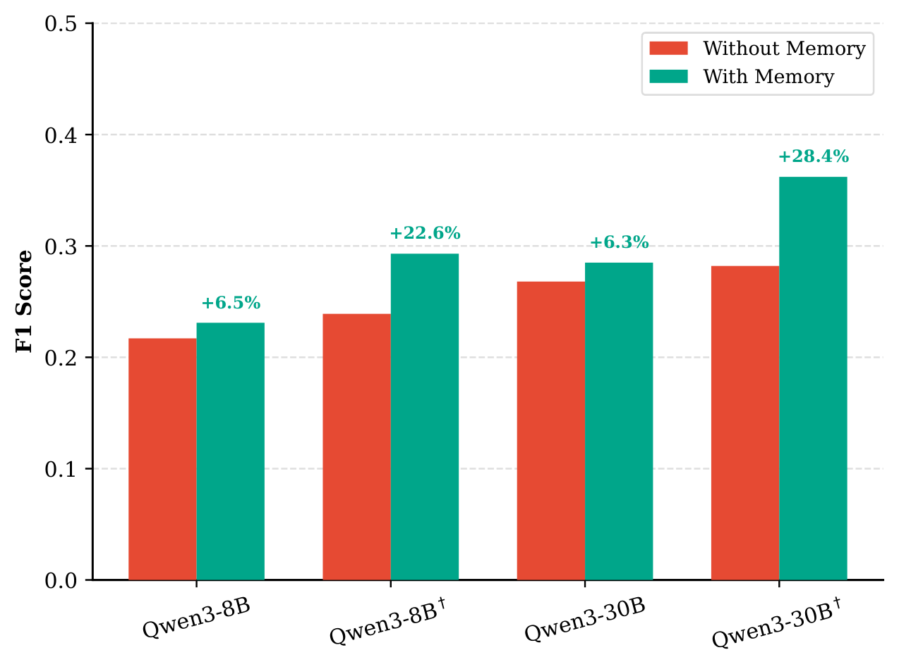

# ScholarGym: Benchmarking Large Language Model Capabilities in the Information-Gathering Stage of Deep Research

<p align="center">
  <a href="https://arxiv.org/abs/2601.21654"></a>
  <a href="LICENSE"></a>
</p>

## Abstract

Large language models have advanced from single-turn question answering to **deep research** systems that iteratively decompose research questions, invoke retrieval tools, and synthesize information across multiple rounds. Evaluating such systems typically involves scoring their final research reports holistically, but this end-to-end paradigm tightly couples the language model's decision-making, workflow design, and environmental feedback, precluding decomposable analysis of individual components. Moreover, reliance on live APIs introduces non-determinism—temporal drift, rate limiting, and evolving backend states cause identical tool invocations to yield different results across runs—further undermining reproducibility.

We introduce **ScholarGym**, an evaluation environment that isolates the information-gathering stage of deep research on academic literature. Under a unified workflow, ScholarGym decomposes the research process into three explicit stages—**Query Planning**, **Tool Invocation**, and **Relevance Assessment**—and evaluates each against **2,536 expert-annotated queries** over a **static corpus of 570K papers** with deterministic retrieval. Systematic experiments reveal that iterative query decomposition yields **2.9–3.3× F1 gains** over single-query retrieval, models with extended thinking trade recall for precision, and Query Planning quality together with Relevance Assessment constitute dual bottlenecks that separate proprietary from open-source model performance.

## Framework

<p align="center">
  
</p>

**Overview of ScholarGym.** Each iteration comprises three stages connected by directed information flow. **Query Planning** receives the subquery tree, experience buffer, and feedback from the previous iteration, then outputs newly generated child nodes and an updated experience buffer. The resulting subqueries are passed to **Tool Invocation**, which parameterizes retrieval calls and executes them against the corpus; retrieved candidates undergo relevance-based ranking before selection. **Relevance Assessment** evaluates ranked papers and produces feedback to guide the next iteration.

## Deep Research Workflow

Given a research query, the workflow decomposes it into *subqueries*—specialized search terms targeting specific aspects—and iteratively expands this set based on retrieval outcomes. Each iteration comprises three stages:

**Stage 1: Query Planning.** Analyzes search progress and proposes new subqueries. Maintains a subquery tree rooted at the original query, where each node represents a subquery derived from its parent through semantic refinement. New subqueries are proposed via three actions:
- **Derive** — creates a more specific subquery from an existing one (e.g., "transformer efficiency" → "sparse attention")
- **Expand** — creates a sibling subquery exploring a different aspect
- **Continue** — requests additional results for an existing subquery

**Stage 2: Tool Invocation.** Generates parameterized retrieval calls and executes them against the static paper corpus. Supports both **sparse retrieval** (BM25) and **dense retrieval** (Qwen3-Embedding-0.6B + Qdrant vector database). The static corpus ensures identical calls yield identical results across runs.

**Stage 3: Relevance Assessment.** Evaluates each candidate paper against the research objective. Two strategies are supported:
- **Abstract-only** — classifies relevance from titles and abstracts
- **Adaptive Browsing** — permits an "uncertain" label for ambiguous cases, triggering full-text examination before final classification

**Memory Mechanism.** Two structures maintain coherent state across iterations: the **subquery tree** organizes subqueries hierarchically, recording derivation paths and retrieved papers; the **experience buffer** compresses search history into a fixed-length summary, preventing context overflow while preserving key insights.

## Benchmark

> **Coming Soon** — The benchmark dataset and pre-built indices will be released upon publication.

ScholarGym is constructed from two established academic retrieval datasets: [PaSa](https://github.com/bytedance/pasa) and [LitSearch](https://github.com/princeton-nlp/LitSearch). The benchmark is partitioned into two evaluation subsets:

| Subset | #Queries | Avg. #GT | Avg. Length |
|--------|----------|----------|-------------|
| Test-Fast | 200 | 1.9 | 113.0 |
| Test-Hard | 100 | 2.6 | 101.8 |
| ALL | 2,536 | 2.3 | 110.4 |

- **Test-Fast** — 200 queries sampled for balanced coverage across sources, enabling rapid iteration during development.
- **Test-Hard** — 100 queries on which all evaluated models perform poorly; these queries tend to have larger ground-truth sets and require finding papers across multiple research areas.

**Corpus:** 570K papers spanning computer science, physics, and mathematics, deduplicated by arXiv identifier and enriched with metadata via the arXiv API.

## Evaluation Metrics

Metrics are computed at two stages: *retrieval* (candidates before filtering) and *selection* (final output).

| Metric | Description |
|--------|-------------|
| **Recall (R)** | Fraction of ground-truth papers in the final selected set |
| **Precision (P)** | Fraction of selected papers that are ground-truth |
| **F1** | Harmonic mean of Recall and Precision |
| **Ret.R / Ret.P** | Retrieval-stage recall and precision (before assessment) |
| **Avg.Distance** | Measures query planning quality—how early ground-truth papers appear in retrieval rankings |
| **GT Discard Rate** | Fraction of retrieved ground-truth papers incorrectly discarded during assessment |

**Avg.Distance** quantifies query planning effectiveness:

$$\text{Avg.Distance} = \frac{1}{|\mathcal{G}|} \sum_{g \in \mathcal{G}} \max\left(1 - \frac{r_g}{c},\ 0\right)$$

where $r_g$ is the best rank of ground-truth paper $g$ across all subqueries and $c=100$ is the cutoff.

## Main Results

Performance on Test-Fast and Test-Hard (sparse retrieval, Abstract-only, iteration 5):

| Model | R | P | F1 | Ret.R | Ret.P | Ret.F1 |
|-------|---|---|-----|-------|-------|--------|
| *Direct Query Baseline* | | | | | | |
| Qwen3-8B | 0.185 | 0.042 | 0.069 | 0.210 | 0.036 | 0.061 |
| Qwen3-30B | 0.312 | 0.058 | 0.098 | 0.350 | 0.052 | 0.091 |
| *Open-Source Models* | | | | | | |
| Qwen3-8B | 0.483 | 0.152 | 0.231 | 0.550 | 0.022 | 0.042 |
| Qwen3-30B | 0.673 | 0.181 | 0.285 | 0.720 | 0.011 | 0.021 |
| Qwen3-30B† | 0.482 | 0.290 | 0.362 | 0.590 | 0.025 | 0.048 |
| GLM-4.7 | 0.754 | 0.111 | 0.194 | 0.814 | 0.010 | 0.020 |
| *Proprietary Models* | | | | | | |
| DeepSeek-V3.2 | 0.855 | 0.135 | 0.233 | 0.862 | 0.007 | 0.014 |
| DeepSeek-V3.2† | 0.812 | 0.287 | 0.423 | 0.872 | 0.009 | 0.018 |
| GPT-5.2 | 0.837 | **0.305** | **0.447** | 0.883 | 0.009 | 0.018 |
| Gemini3-Pro | **0.950** | 0.199 | 0.329 | **0.958** | 0.011 | 0.022 |

† denotes extended thinking mode.

### Key Findings

- **Iterative planning** improves F1 by 2.9–3.3× over Direct Query baselines.
- **GPT-5.2** achieves the best F1 (0.447) by balancing recall and precision; **Gemini3-Pro** attains the highest recall (0.950).
- **Extended thinking** trades recall for precision via more aggressive filtering; F1 gains scale with model capability.
- **Proprietary models** achieve 43% higher Avg.Distance than open-source alternatives, reflecting superior query formulation.
- **Memory mechanism** prevents query redundancy; removing the experience buffer degrades F1 by 6–22%.
- **Dense retrieval** improves recall by 7–26% for standard models, with smaller gains for thinking-enabled variants.

### Experimental Figures

<p align="center">
  
</p>
<p align="center"><em>Recall and Precision trajectories across 5 iterations on Test-Fast.</em></p>

<p align="center">
  
</p>
<p align="center"><em>Avg.Distance trajectories across iterations. Higher values indicate queries that rank ground-truth papers earlier in retrieval results.</em></p>

<p align="center">
  
</p>
<p align="center"><em>Per-iteration GT Discard Rate (%). Darker cells indicate higher discard rates of ground-truth papers during relevance assessment.</em></p>

<p align="center">
  
  &nbsp;&nbsp;
  
</p>
<p align="center"><em>Left: Sparse vs. dense retrieval recall comparison. Right: Impact of the memory mechanism on F1.</em></p>

## Installation

```bash
# Clone the repository
git clone https://github.com/shenhao-stu/ScholarGym.git
cd ScholarGym

# Create virtual environment
conda create -n scholargym python=3.10
conda activate scholargym

# Install dependencies
pip install -r requirements.txt
```

## Quick Start

> **Note:** Dataset and pre-built indices are coming soon.

```bash
# Evaluate with Deep Research workflow
python code/eval.py \
    --paper_db data/paper_db.json \
    --benchmark_jsonl data/benchmark.jsonl \
    --bm25_path data/bm25_index.pkl \
    --workflow deep_research \
    --search_method bm25 \
    --max_iterations 5 \
    --results_per_query 10 \
    --llm_model qwen3:8b
```

## Project Structure

```
ScholarGym/
├── code/
│   ├── agent/                    # Agent implementations
│   │   ├── planner.py           # Query Planning stage
│   │   ├── selector.py          # Relevance Assessment stage
│   │   ├── browser.py           # Adaptive Browsing module
│   │   └── summarizer.py        # Paper content summarization
│   ├── mcp/                      # Tool Invocation (retrieval backend)
│   │   ├── retrieval_mcp.py     # BM25 & vector retrieval
│   │   └── pdf_mcp.py           # PDF content extraction
│   ├── config.py                 # Configuration settings
│   ├── deeprag.py               # Deep Research workflow orchestration
│   ├── eval.py                  # Evaluation pipeline
│   ├── metrics.py               # Evaluation metrics (R, P, F1, Avg.Distance)
│   ├── prompt.py                # Prompt templates
│   ├── rag.py                   # RAG system (FAISS + BM25)
│   ├── simplerag.py             # Direct Query baseline
│   ├── structures.py            # Data structures
│   └── utils.py                 # Utilities
├── fig/                          # Experimental figures (PNG)
├── data/                         # Benchmark data (coming soon)
├── requirements.txt
└── README.md
```

## Citation

If you find ScholarGym useful for your research, please cite our paper:

```bibtex
@article{shen2026scholargym,
  title={ScholarGym: Benchmarking Deep Research Workflows on Academic Literature Retrieval},
  author={Shen, Hao and Yang, Hang and Gu, Zhouhong},
  journal={arXiv preprint arXiv:2601.21654},
  year={2026}
}
```

## Acknowledgments

We thank the authors of [PaSa](https://github.com/bytedance/pasa) and [LitSearch](https://github.com/princeton-nlp/LitSearch) for providing the base datasets that enabled the construction of ScholarGym.

## License

This project is licensed under the MIT License — see the [LICENSE](LICENSE) file for details.

## Contact

For questions and feedback, please open an issue or contact [hshen22@m.fudan.edu.cn](mailto:hshen22@m.fudan.edu.cn).
