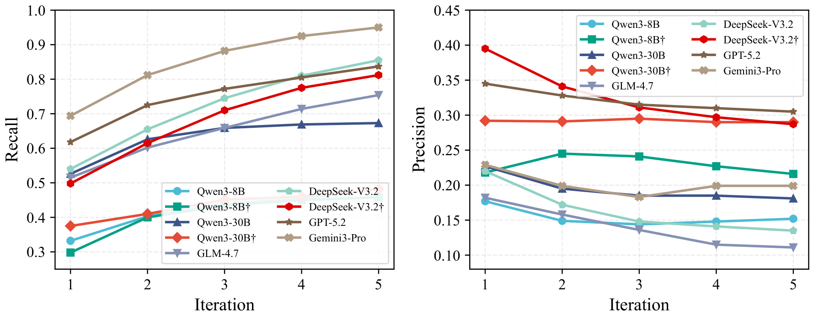
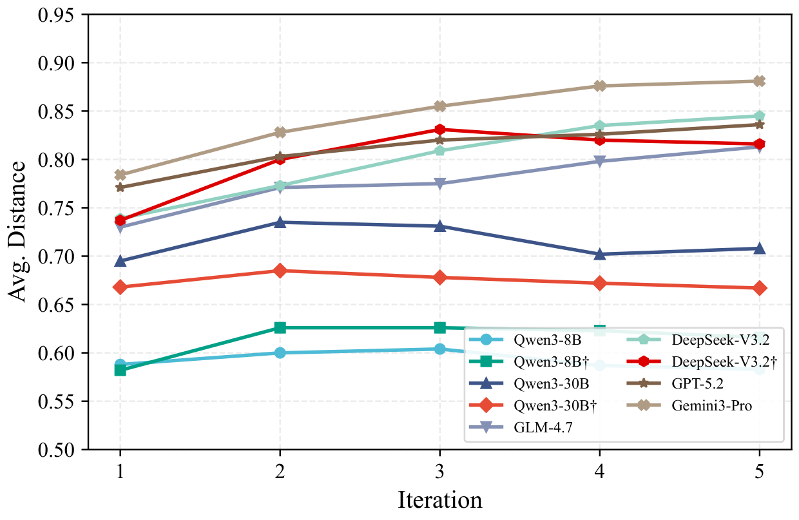
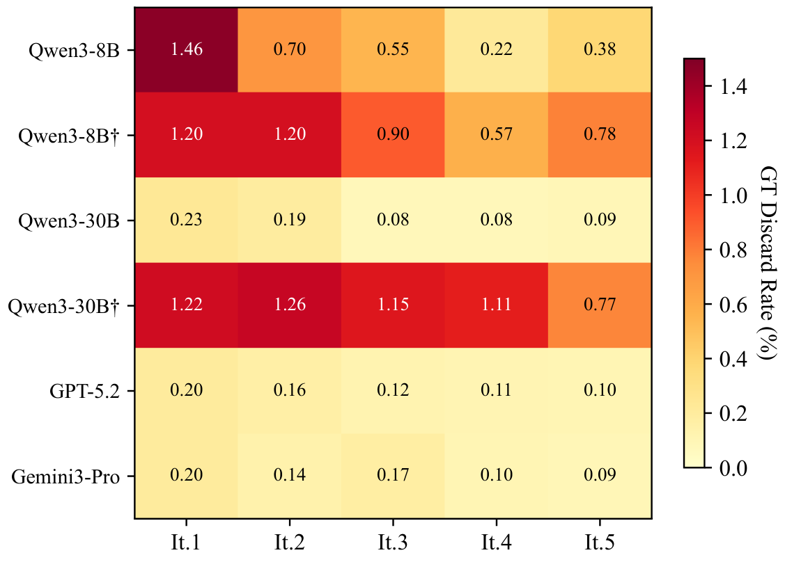
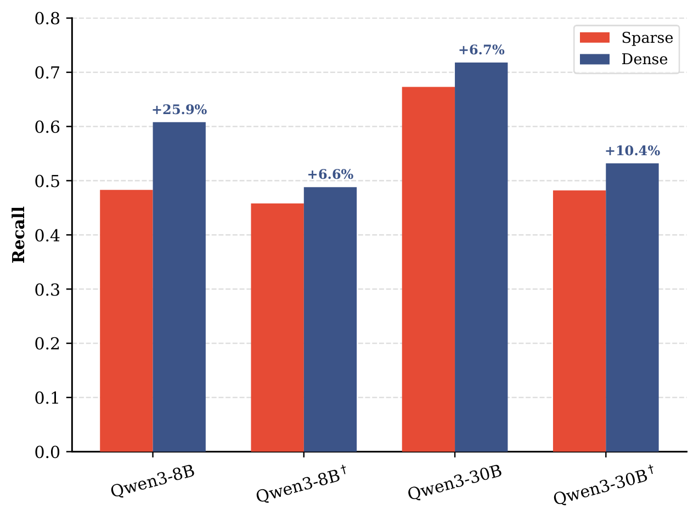
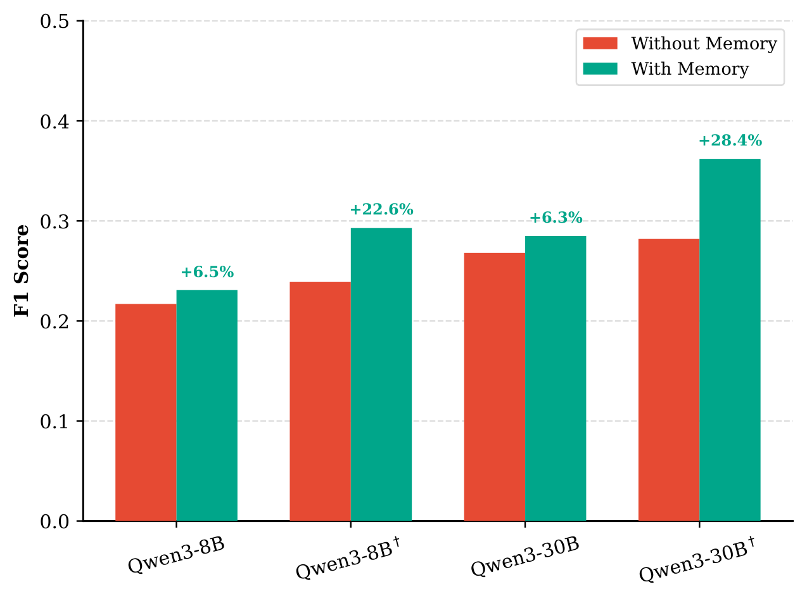

# ScholarGym: Benchmarking Large Language Model Capabilities in the Information-Gathering Stage of Deep Research

<p align="center">
  <a href="https://arxiv.org/abs/2601.21654"></a>
  <a href="https://huggingface.co/datasets/shenhao/ScholarGym"></a>
  <a href="https://modelscope.cn/datasets/shenhao23/ScholarGym"></a>
  <a href="LICENSE"></a>
</p>

## Abstract

Large language models have advanced from single-turn question answering to **deep research** systems that iteratively decompose research questions, invoke retrieval tools, and synthesize information across multiple rounds. Evaluating such systems typically involves scoring their final research reports holistically, but this end-to-end paradigm tightly couples the language model's decision-making, workflow design, and environmental feedback, precluding decomposable analysis of individual components. Moreover, reliance on live APIs introduces non-determinism—temporal drift, rate limiting, and evolving backend states cause identical tool invocations to yield different results across runs—further undermining reproducibility.

We introduce **ScholarGym**, an evaluation environment that isolates the information-gathering stage of deep research on academic literature. Under a unified workflow, ScholarGym decomposes the research process into three explicit stages—**Query Planning**, **Tool Invocation**, and **Relevance Assessment**—and evaluates each against **2,536 expert-annotated queries** over a **static corpus of 570K papers** with deterministic retrieval. Systematic experiments reveal that iterative query decomposition yields **2.9–3.3× F1 gains** over single-query retrieval, models with extended thinking trade recall for precision, and Query Planning quality together with Relevance Assessment constitute dual bottlenecks that separate proprietary from open-source model performance.

## Framework

<p align="center">
  
</p>

**Overview of ScholarGym.** Each iteration comprises three stages connected by directed information flow. **Query Planning** receives the subquery tree, experience buffer, and feedback from the previous iteration, then outputs newly generated child nodes and an updated experience buffer. The resulting subqueries are passed to **Tool Invocation**, which parameterizes retrieval calls and executes them against the corpus; retrieved candidates undergo relevance-based ranking before selection. **Relevance Assessment** evaluates ranked papers and produces feedback to guide the next iteration.

## Deep Research Workflow

Given a research query, the workflow decomposes it into *subqueries*—specialized search terms targeting specific aspects—and iteratively expands this set based on retrieval outcomes. Each iteration comprises three stages:

**Stage 1: Query Planning.** Analyzes search progress and proposes new subqueries. Maintains a subquery tree rooted at the original query, where each node represents a subquery derived from its parent through semantic refinement. New subqueries are proposed via three actions:
- **Derive** — creates a more specific subquery from an existing one (e.g., "transformer efficiency" → "sparse attention")
- **Expand** — creates a sibling subquery exploring a different aspect
- **Continue** — requests additional results for an existing subquery

**Stage 2: Tool Invocation.** Generates parameterized retrieval calls and executes them against the static paper corpus. Supports both **sparse retrieval** (BM25) and **dense retrieval** (Qwen3-Embedding-0.6B + Qdrant vector database). The static corpus ensures identical calls yield identical results across runs.

**Stage 3: Relevance Assessment.** Evaluates each candidate paper against the research objective. Two strategies are supported:
- **Abstract-only** — classifies relevance from titles and abstracts
- **Adaptive Browsing** — permits an "uncertain" label for ambiguous cases, triggering full-text examination before final classification

**Memory Mechanism.** Two structures maintain coherent state across iterations: the **subquery tree** organizes subqueries hierarchically, recording derivation paths and retrieved papers; the **experience buffer** compresses search history into a fixed-length summary, preventing context overflow while preserving key insights.

## Benchmark & Dataset

ScholarGym is constructed from two established academic retrieval datasets: [PaSa](https://github.com/bytedance/pasa) and [LitSearch](https://github.com/princeton-nlp/LitSearch). The benchmark comprises two core components:

### 📚 Dataset Components

| Dataset | File | Description | Size |
|---------|------|-------------|------|
| **Query Benchmark** | `scholargym_bench.jsonl` | 2,536 expert-annotated research queries with ground-truth papers | ~1.3 MB |
| **Paper Corpus** | `scholargym_paper_db.json` | 570K academic papers with arXiv metadata | ~860 MB |

### 📊 Query Benchmark (`scholargym_bench.jsonl`)

The query benchmark contains 2,536 research queries with expert-annotated ground-truth papers:

| Subset | #Queries | Avg. #GT | Avg. Length |
|--------|----------|----------|-------------|
| Test-Fast | 200 | 1.9 | 113.0 |
| Test-Hard | 100 | 2.6 | 101.8 |
| ALL | 2,536 | 2.3 | 110.4 |

- **Test-Fast** — 200 queries sampled for balanced coverage across sources, enabling rapid iteration during development.
- **Test-Hard** — 100 queries on which all evaluated models perform poorly; these queries tend to have larger ground-truth sets and require finding papers across multiple research areas.

**Query Sources:**
- **PaSa-AutoScholar**: Generated from citation contexts
- **PaSa-RealScholar**: Human-curated research questions
- **LitSearch**: Real-world literature search scenarios

**JSONL Format:**
```json
{
  "query_id": "pasa_auto_001",
  "query": "What methods exist for improving transformer efficiency through sparse attention?",
  "gt_arxiv_ids": ["2101.03935", "2009.00031"],
  "date_constraint": "2024-12-31",
  "source": "pasa_auto",
  "split": "test"
}
```

### 📄 Paper Corpus (`scholargym_paper_db.json`)

The paper corpus contains 570K academic papers spanning computer science, physics, and mathematics:

- **Deduplicated** by arXiv identifier
- **Enriched** with metadata via arXiv API
- **Deterministic retrieval** for reproducible evaluation

**JSON Format:**
```json
{
  "arxiv_id": "2101.03935",
  "title": "Sparse Attention Mechanisms for Efficient Transformers",
  "abstract": "We propose novel sparse attention patterns...",
  "authors": ["Author A", "Author B"],
  "published": "2021-01-11",
  "categories": ["cs.CL", "cs.LG"],
  "url": "https://arxiv.org/abs/2101.03935"
}
```

## Evaluation Metrics

Metrics are computed at two stages: *retrieval* (candidates before filtering) and *selection* (final output).

| Metric | Description |
|--------|-------------|
| **Recall (R)** | Fraction of ground-truth papers in the final selected set |
| **Precision (P)** | Fraction of selected papers that are ground-truth |
| **F1** | Harmonic mean of Recall and Precision |
| **Ret.R / Ret.P** | Retrieval-stage recall and precision (before assessment) |
| **Avg.Distance** | Measures query planning quality—how early ground-truth papers appear in retrieval rankings |
| **GT Discard Rate** | Fraction of retrieved ground-truth papers incorrectly discarded during assessment |

**Avg.Distance** quantifies query planning effectiveness:

$$\text{Avg.Distance} = \frac{1}{|\mathcal{G}|} \sum_{g \in \mathcal{G}} \max\left(1 - \frac{r_g}{c},\ 0\right)$$

where $r_g$ is the best rank of ground-truth paper $g$ across all subqueries and $c=100$ is the cutoff.

## Main Results

Performance on Test-Fast and Test-Hard (sparse retrieval, Abstract-only, iteration 5):

| Model | R | P | F1 | Ret.R | Ret.P | Ret.F1 |
|-------|---|---|-----|-------|-------|--------|
| *Direct Query Baseline* | | | | | | |
| Qwen3-8B | 0.185 | 0.042 | 0.069 | 0.210 | 0.036 | 0.061 |
| Qwen3-30B | 0.312 | 0.058 | 0.098 | 0.350 | 0.052 | 0.091 |
| *Open-Source Models* | | | | | | |
| Qwen3-8B | 0.483 | 0.152 | 0.231 | 0.550 | 0.022 | 0.042 |
| Qwen3-30B | 0.673 | 0.181 | 0.285 | 0.720 | 0.011 | 0.021 |
| Qwen3-30B† | 0.482 | 0.290 | 0.362 | 0.590 | 0.025 | 0.048 |
| GLM-4.7 | 0.754 | 0.111 | 0.194 | 0.814 | 0.010 | 0.020 |
| *Proprietary Models* | | | | | | |
| DeepSeek-V3.2 | 0.855 | 0.135 | 0.233 | 0.862 | 0.007 | 0.014 |
| DeepSeek-V3.2† | 0.812 | 0.287 | 0.423 | 0.872 | 0.009 | 0.018 |
| GPT-5.2 | 0.837 | **0.305** | **0.447** | 0.883 | 0.009 | 0.018 |
| Gemini3-Pro | **0.950** | 0.199 | 0.329 | **0.958** | 0.011 | 0.022 |

† denotes extended thinking mode.

### Key Findings

- **Iterative planning** improves F1 by 2.9–3.3× over Direct Query baselines.
- **GPT-5.2** achieves the best F1 (0.447) by balancing recall and precision; **Gemini3-Pro** attains the highest recall (0.950).
- **Extended thinking** trades recall for precision via more aggressive filtering; F1 gains scale with model capability.
- **Proprietary models** achieve 43% higher Avg.Distance than open-source alternatives, reflecting superior query formulation.
- **Memory mechanism** prevents query redundancy; removing the experience buffer degrades F1 by 6–22%.
- **Dense retrieval** improves recall by 7–26% for standard models, with smaller gains for thinking-enabled variants.

### Experimental Figures

<p align="center">
  
</p>
<p align="center"><em>Recall and Precision trajectories across 5 iterations on Test-Fast.</em></p>

<p align="center">
  
</p>
<p align="center"><em>Avg.Distance trajectories across iterations. Higher values indicate queries that rank ground-truth papers earlier in retrieval results.</em></p>

<p align="center">
  
</p>
<p align="center"><em>Per-iteration GT Discard Rate (%). Darker cells indicate higher discard rates of ground-truth papers during relevance assessment.</em></p>

<p align="center">
  
  &nbsp;&nbsp;
  
</p>
<p align="center"><em>Left: Sparse vs. dense retrieval recall comparison. Right: Impact of the memory mechanism on F1.</em></p>

## Installation

```bash
# Clone the repository
git clone https://github.com/shenhao-stu/ScholarGym.git
cd ScholarGym

# Create virtual environment
conda create -n scholargym python=3.10
conda activate scholargym

# Install dependencies
pip install -r requirements.txt
```

## Quick Start

### Download Dataset

ScholarGym datasets are available on both HuggingFace and ModelScope:

**HuggingFace**
```python
from datasets import load_dataset
load_dataset('shenhao/ScholarGym')
```

**ModelScope**
```python
from modelscope.msdatasets import MsDataset
MsDataset.load('shenhao23/ScholarGym')
```

### Run Evaluation

```bash
# Evaluate with Deep Research workflow
python code/eval.py \
    --paper_db data/scholargym_paper_db.json \
    --benchmark_jsonl data/scholargym_bench.jsonl \
    --bm25_path data/bm25_index.pkl \
    --workflow deep_research \
    --search_method bm25 \
    --max_iterations 5 \
    --results_per_query 10 \
    --llm_model qwen3:8b
```

### Managing Multiple Experiments

For running and tracking several experiments in parallel (e.g., comparing
models or browser modes), use the experiment manager under `scripts/exp/`.
It reads a single `experiments.yaml`, renders per-run configs, launches each
eval as a detached background process, and provides a live dashboard.

**Manifest** (`experiments.yaml` at the project root):

```yaml
runs_dir: runs

defaults:
  benchmark_jsonl: data/test_fast.jsonl
  workflow: deep_research
  search_method: bm25
  max_iterations: 5
  results_per_query: 10
  prompt_type: complex
  enable_reasoning: true
  browser_mode: NONE

experiments:
  - name: qwen3-8b-none        # unique; becomes runs/<name>/
    group: qwen3-8b            # model family / second-level grouping in monitors
    type: main                 # top-level grouping in monitors (e.g. main/ablation/debug)

# monitors render as: type -> group -> run
    model: qwen3-8b
    is_local: true
    browser_mode: NONE

  - name: gpt54-none
    group: gpt-5.4
    model: gpt-5.4
    is_local: false
    env:                       # process-level env, supports ${VAR} interpolation
      OPENAI_API_KEY: ${OPENAI_API_KEY}
      OPENAI_BASE_URL: https://your-endpoint/v1
```

**Commands**:

```bash
# Launch (or resume) all experiments. Idempotent: existing checkpoints auto-resume.
python scripts/exp/launcher.py up

# Launch only a subset
python scripts/exp/launcher.py up --only qwen3-8b-none,gpt54-none

# Wipe an existing run dir and start fresh
python scripts/exp/launcher.py up --only qwen3-8b-none --fresh

# One-shot status table (no live refresh)
python scripts/exp/launcher.py status

# Stop running experiments (SIGTERM, then SIGKILL after 5s)
python scripts/exp/launcher.py down
python scripts/exp/launcher.py down --only qwen3-8b-none

# Restart (down + up in one command), optionally with --fresh
python scripts/exp/launcher.py restart --only qwen3-8b-none
python scripts/exp/launcher.py restart --only qwen3-8b-none --fresh

# Live dashboard (rich TUI, refreshes every 5s; Ctrl+C to exit, experiments unaffected)
python scripts/exp/dashboard.py

# Full-featured TUI: two-pane, keyboard nav, sparklines, kill/restart from inside
python scripts/exp/tui.py

# Web UI: open http://127.0.0.1:8765 in a browser
python scripts/exp/web.py
python scripts/exp/web.py --host 0.0.0.0 --port 9000   # share over network
```

**Three monitor flavors**:

| Tool | Best for | Features |
|---|---|---|
| `dashboard.py` | quick glance, ssh sessions | rich.live table grouped by type → group → run, no interaction |
| `tui.py` | working session, multiple experiments | textual two-pane: table + log tail + sparklines, grouped by type → group → run, j/k navigation, K kill, R restart, F restart-fresh, all with confirm modals |
| `web.py` | sharing, remote viewing | FastAPI + HTML, click row → details + log tail + SVG sparklines, grouped by type → group → run, read-only |

**TUI key bindings** (`tui.py`):

| Key | Action |
|---|---|
| `Tab` | switch focus between table and log |
| `j` / `↓` | next row when table focused; scroll log down when log focused |
| `k` / `↑` | previous row when table focused; scroll log up when log focused |
| `PageDown` / `PageUp` | scroll log down / up |
| `End` | jump log to latest |
| `Home` | jump log to top |
| `r` | refresh now |
| `K` | kill selected (with confirm) |
| `R` | restart selected — preserves checkpoint (with confirm) |
| `F` | fresh restart — wipes checkpoint (with confirm) |
| `L` | toggle right detail panel |
| `q` / `Ctrl+C` | quit (does not affect experiments) |

**Run directory layout** (`runs/<name>/`):

```
config.py              # auto-generated fully resolved config snapshot in the same sectioned format as code/config.py
manifest.yaml          # snapshot of the YAML entry for this run
state.json             # {pid, start_time, status, total_queries, ...}
run.log                # stdout + stderr from eval.py
detailed_results.jsonl # per-query checkpoint (used for resume)
results.json           # final aggregated metrics (created when done)
```

**Global summary file**:

```
runs/evaluation_summary.jsonl  # append-only aggregate summary across managed runs
```

**Dashboard features**:

- Rows grouped as `type -> group -> run` (e.g. `main -> qwen3-8b -> qwen3-8b-none`), color-coded by status
  (`▶ running`, `✓ done`, `✗ crashed`, `⧗ stalled`, `⊘ stopped`)
- Live progress bar, elapsed time, ETA, latest iteration's R/P metric
- Anomaly detection: tails `run.log` for `Traceback`, `APIError`,
  `ConnectionError`, `RateLimitError`, `TimeoutError` → flags ⚠
- Crash detection: process gone but not done → marks `crashed` red
- **No auto-restart** — on crash, fix the root cause and re-run
  `launcher.py up --only <name>` to resume from checkpoint

**Migrating existing checkpoints** into the new layout:

```bash
python scripts/exp/migrate.py --dry-run    # preview
python scripts/exp/migrate.py              # actually copy
```

The migration script copies `detailed_results.jsonl` from the old
`eval_results_*/` subdirectories into `runs/<name>/` and writes a synthetic
`state.json` so the next `launcher.py up` resumes from where you left off.
The mapping table at the top of `scripts/exp/migrate.py` is project-specific
and should be edited if your old directory names differ.

## Project Structure

```
ScholarGym/
├── code/
│   ├── agent/                    # Agent implementations
│   │   ├── planner.py           # Query Planning stage
│   │   ├── selector.py          # Relevance Assessment stage
│   │   ├── browser.py           # Adaptive Browsing module
│   │   └── summarizer.py        # Paper content summarization
│   ├── mcp/                      # Tool Invocation (retrieval backend)
│   │   ├── retrieval_mcp.py     # BM25 & vector retrieval
│   │   └── pdf_mcp.py           # PDF content extraction
│   ├── config.py                 # Configuration settings
│   ├── deeprag.py               # Deep Research workflow orchestration
│   ├── eval.py                  # Evaluation pipeline
│   ├── metrics.py               # Evaluation metrics (R, P, F1, Avg.Distance)
│   ├── prompt.py                # Prompt templates
│   ├── rag.py                   # RAG system (FAISS + BM25)
│   ├── simplerag.py             # Direct Query baseline
│   ├── structures.py            # Data structures
│   └── utils.py                 # Utilities
├── data/                         # 📚 Dataset files
│   ├── scholargym_bench.jsonl   # Query benchmark (2,536 queries)
│   └── scholargym_paper_db.json # Paper corpus (570K papers)
├── fig/                          # Experimental figures (PNG)
├── requirements.txt             # Python dependencies
└── README.md                    # This file
```

## Citation

If you find ScholarGym useful for your research, please cite our paper:

```bibtex
@article{shen2026scholargym,
  title={ScholarGym: Benchmarking Large Language Model Capabilities in the Information-Gathering Stage of Deep Research},
  author={Shen, Hao and Yang, Hang and Gu, Zhouhong},
  journal={arXiv preprint arXiv:2601.21654},
  year={2026}
}
```

## Acknowledgments

We thank the authors of [PaSa](https://github.com/bytedance/pasa) and [LitSearch](https://github.com/princeton-nlp/LitSearch) for providing the base datasets that enabled the construction of ScholarGym.

## License

This project is licensed under the Apache 2.0 License — see the [LICENSE](LICENSE) file for details.

## Contact

For questions and feedback, please open an issue or contact [hshen22@m.fudan.edu.cn](mailto:hshen22@m.fudan.edu.cn).
